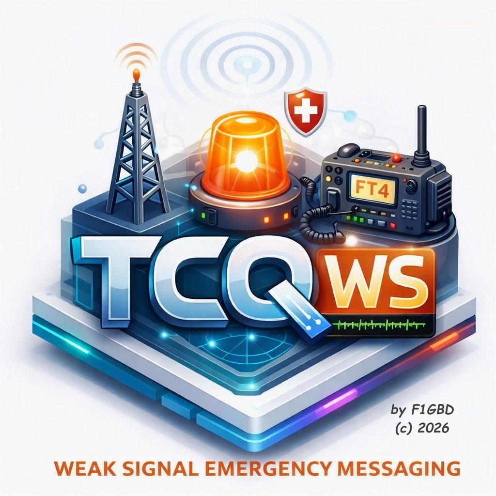
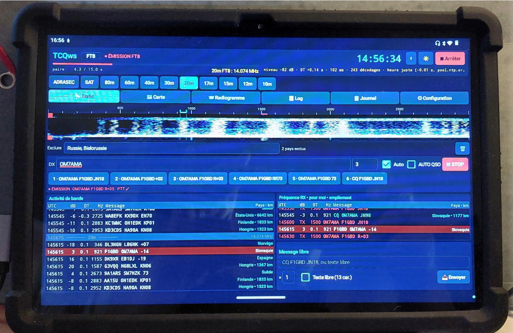
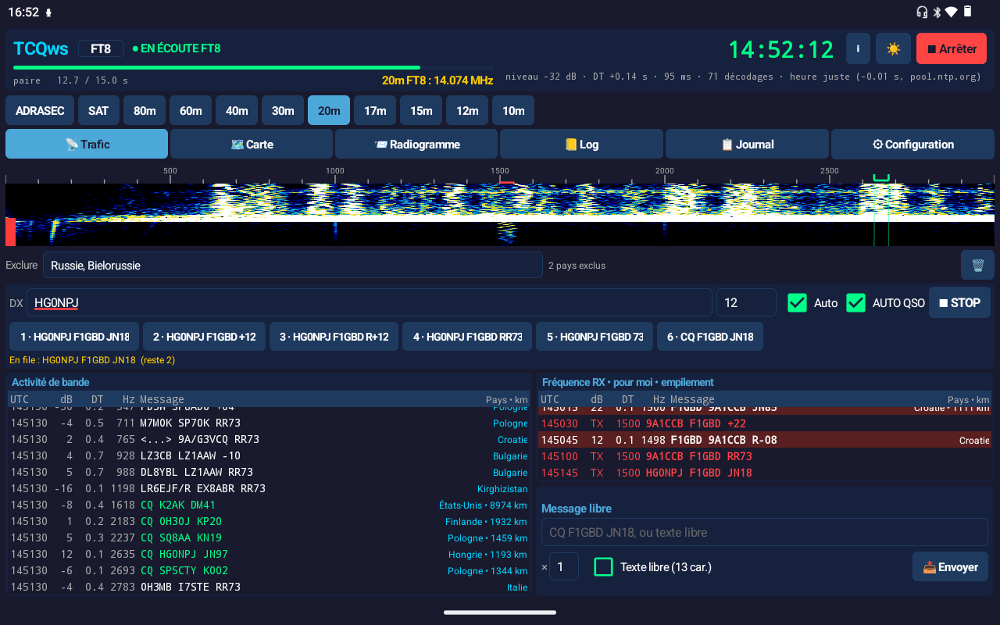
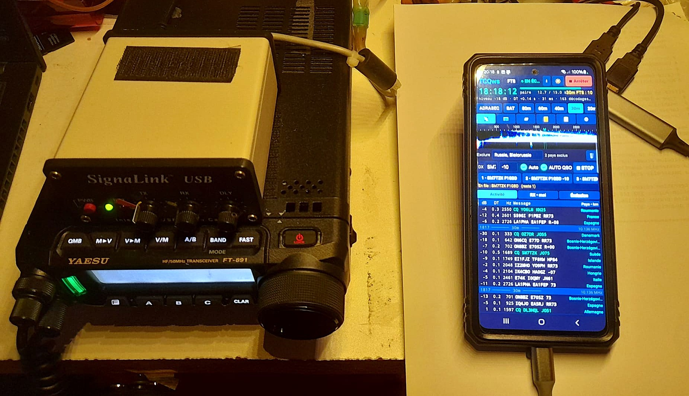
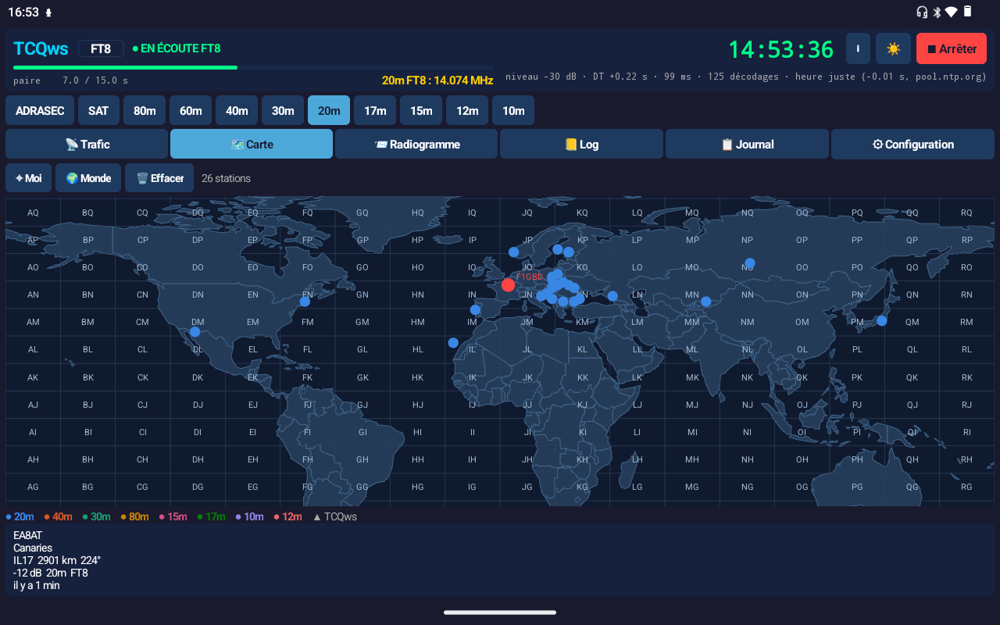
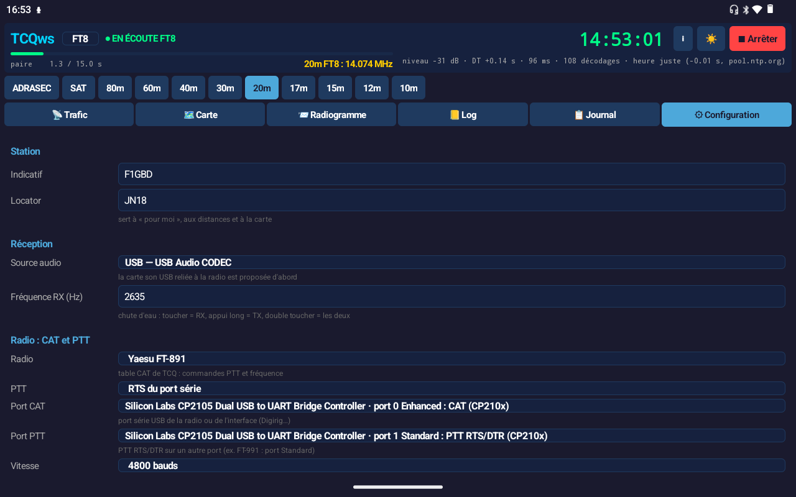
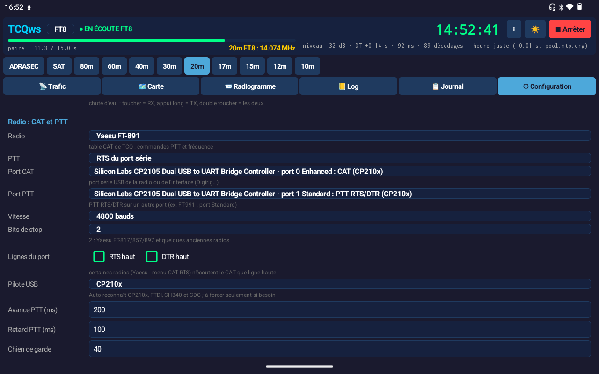
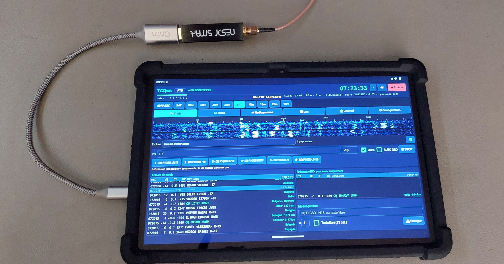
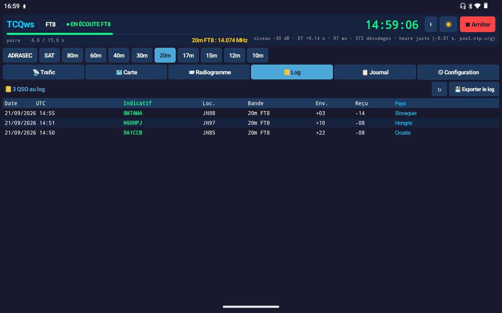
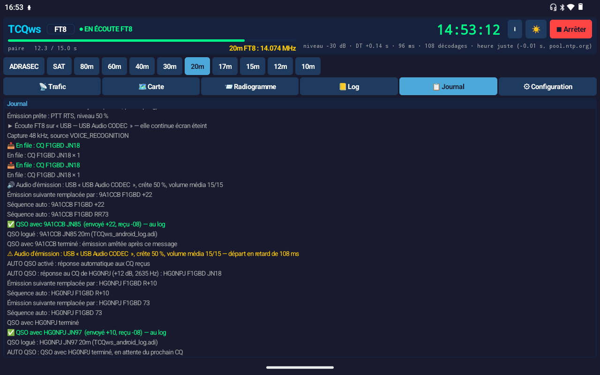

# TCQws Android

### Le FT4 / FT8 des opérateurs ADRASEC, dans la poche

*La station TCQws sur téléphone ou tablette : QSO FT4/FT8 et log ADIF · radiogrammes ADRASEC avec accusé de réception · alerte FLASH qui sonne même écran éteint · CHAPPE-26 décodé en clair · CAT et PTT par le câble USB de la radio · écoute par clé RTL-SDR · compatible au bit près avec TCQws PC.*

## 📥 Télécharger TCQws Android v0.5.1

### **[⬇ TCQws_android-0.5.1.apk](https://github.com/f1gbd/F1GBD/releases/download/tcqws-android-v0.5.1/TCQws_android-0.5.1.apk)**

*À ouvrir directement sur le téléphone ou la tablette. Android 7 ou plus récent, processeur 64 bits (arm64). Aucun compte, aucune publicité, aucune donnée envoyée nulle part.*

**Nouveau en 0.5.1 : la distance reste affichée pendant le QSO** · **écoute FT4 / FT8 par clé RTL-SDR**, sans transceiver — [📡 voir plus bas](#-écoute-par-clé-sdr-rtl-sdr)

[🖥 TCQws pour Windows](../README.md) · [📜 Historique TCQws](../HISTORIQUE.md) · [📖 Manuel PDF Android](doc/MANUEL_TCQws_android.pdf) · [📖 Manuel PDF (PC)](../doc/MANUEL_TCQws.pdf) · [🔌 Raccorder la radio](#-raccorder-la-radio) · [📡 Clé SDR](#-écoute-par-clé-sdr-rtl-sdr) · [🚨 Alerte FLASH](#-radiogrammes-et-alerte-flash)

---

## En une phrase

TCQws Android, c'est **TCQws PC dans un téléphone** : les mêmes messages, les mêmes radiogrammes, la même alerte FLASH, le même code CHAPPE-26, le même décodeur FT4 cohérent. Ce n'est pas une réécriture : le cœur est **le code même de la version PC**, embarqué dans l'application. Un radiogramme envoyé par un téléphone se lit sur un PC, et inversement, **au bit près**.

 

Ce qui change, c'est tout ce qui fait un poste de terrain : une tablette et une interface USB suffisent, pas de PC à alimenter, et le téléphone **continue d'écouter écran éteint, en poche** — une alerte FLASH ou un radiogramme qui arrive le fait sonner.

---

## Ce que fait TCQws Android

| | **TCQws Android** |
|---|---|
| **Réception FT4 / FT8** | décodeur de TCQws PC (FT4 cohérent + empilement des répétitions), pays et distance à l'écran, chute d'eau |
| **Émission** | Tx1 à Tx6, message libre, séquence automatique, **AUTO QSO**, PING / PONG, chien de garde |
| **Log ADIF** | chaque QSO terminé est logué ; onglet 📒 Log ; export du fichier `.adi` (Téléchargements, Drive…) |
| **Radiogrammes ADRASEC** | rédaction, code AUTH, compression, redondance, **accusé de réception** et relances automatiques ; AUTH des radiogrammes reçus vérifié |
| **Alerte FLASH** | diffusion en un geste ; à la réception, fenêtre rouge, **alarme et vibration**, même téléphone verrouillé |
| **CHAPPE-26** | les codes reçus sont traduits en clair |
| **Écoute écran éteint** | service Android de premier plan : le téléphone décode en poche, notification permanente |
| **CAT et PTT par USB** | table des radios de TCQ ; PTT par CAT, RTS, DTR, VOX ou rigctld ; port PTT séparé ; boutons de bande qui règlent la radio |
| **Écoute par clé SDR** | clé RTL-SDR par le câble OTG (pilote « RTL2832U ») ou serveur rtl_tcp du réseau ; même démodulation BLU que le PC ; écoute seule |
| **Trafic satellite** | bande SAT : VFO d'émission avant chaque PTT, retour en réception confirmé ensuite (QO-100…) |
| **Heure** | vérifiée par NTP à chaque démarrage |
| **Carte** | stations entendues sur une carte **hors ligne** (aucune tuile à télécharger), grille des locators |
| **Écran** | présentation de TCQws PC ; tablette : les listes côte à côte ; téléphone : en sous-onglets ; thèmes sombre et clair |

---

## 🔌 Raccorder la radio

Un seul câble USB-C (ou un hub USB-C) entre le téléphone et l'interface de la radio : le son **et** la commande passent par lui. TCQws Android reconnaît seul les puces série des interfaces radioamateur, **sans pilote à installer** :

| Interface / radio | Son | CAT / PTT |
|---|---|---|
| **Yaesu SCU-17** (FT-891, FT-817/818, FT-857, FT-897…) | « USB Audio CODEC » | CP2105 : port *Enhanced* = CAT, port *Standard* = PTT par RTS |
| **Digirig** | carte son USB | CP2102 : CAT, PTT par RTS |
| Radios en USB direct (IC-7300, IC-9700, FT-991, FT-710…) | carte son de la radio | CP210x intégré : CAT et PTT par CAT |
| IC-705 et radios récentes en USB | carte son de la radio | CDC-ACM (norme USB) |
| Câbles CAT FTDI ou CH340 | — | reconnus |
| **SignaLink USB** | carte son USB | **VOX** (la SignaLink passe en émission sur le son) |
| Carte son USB seule | carte son USB | **VOX** |
| Radio pilotée par Hamlib sur le réseau | — | **rigctld** (Wi-Fi) |

*Essais de trafic réalisés avec un **Yaesu FT-891** et une **SCU-17** sur tablette Android : CAT, PTT par RTS, séquence auto et AUTO QSO.*

---

## 📡 Écoute par clé SDR (RTL-SDR)

Pas de transceiver sous la main ? Une **clé RTL-SDR** et une antenne suffisent pour écouter le FT4 / FT8 — un poste d'écoute (SWL) de poche, comme avec TCQws PC. Décodages, carte, radiogrammes et **alertes FLASH** fonctionnent à l'identique.

Clé SDR recommandée et utilisée ici: **Nooelec NESDR SMArt v5 SDR - HF/VHF/UHF (100kHz-1.75GHz) RTL-SDR. RTL2832U & R820T2**

1. Installer depuis le Play Store l'application gratuite **« RTL2832U »** (Martin Marinov) : c'est elle qui pilote la clé et la sert par **rtl_tcp**, la méthode du décodeur EPIRB 406 Android.
2. Brancher la clé sur la tablette par le **câble USB-C OTG**.
3. **⚙ Configuration → Réception → Récepteur : Clé SDR RTL-SDR (écoute seule)**, puis dans la section **Clé SDR** :
   - **Mode** : *échantillonnage direct* pour l'onde courte (clé RTL-SDR Blog V3), *tuner normal* en VHF/UHF, ou *transverter* ;
   - **AGC de la puce RTL** cochée (recommandée en échantillonnage direct) ; gain « auto » ; correction ppm si besoin ;
   - **🔎 Tester la clé** : le tuner de la clé doit s'afficher.
4. **▶ Démarrer** : TCQws lance le pilote (Android demande l'accès USB à la clé), s'y connecte, et décode. Les boutons de bande réaccordent la clé.

| Réglage | Rôle |
|---|---|
| Serveur rtl_tcp | `127.0.0.1:1234` pour la clé branchée sur la tablette ; ou l'adresse d'un **rtl_tcp du réseau** (Raspberry Pi au pied de l'antenne) |
| Transverter / décalage | conversion d'un transverter ; la clé est accordée 50 kHz au-dessus du segment, pour que sa raie centrale reste hors bande |
| Inverser I/Q | à cocher seulement si les signaux se voient sur la chute d'eau mais ne décodent jamais (spectre retourné) |

**Écoute seule** : une clé ne transmet pas — émission, PTT et CAT sont coupés, et TCQws le dit. Toutes les minutes, le 📋 Journal donne un bilan de la clé (tuner, fréquence, retard de lecture, niveau, DT, décodages).

---

## 🚀 Installation

1. Télécharger **`TCQws_android-0.5.1.apk`** sur le téléphone ou la tablette.
2. L'ouvrir. Android demande d'autoriser l'installation depuis cette source (le navigateur ou le gestionnaire de fichiers) : accepter.
3. Lancer **TCQws**. Au premier démarrage, quelques secondes sont nécessaires pour préparer le décodeur.

**Mise à jour** : installer la nouvelle version par-dessus ; réglages et log sont conservés.

**Autorisations demandées**

| Autorisation | Pourquoi |
|---|---|
| Micro / enregistrement audio | écouter la radio par la carte son USB (ou le micro du téléphone) |
| Notifications | prévenir d'une alerte FLASH ou d'un radiogramme reçu écran éteint |
| Accès au périphérique USB | demandé par Android au premier branchement de l'interface : CAT et PTT (pour une clé SDR, c'est le pilote « RTL2832U » qui le demande) |
| Internet | uniquement la vérification de l'heure (NTP), la recherche de mise à jour, et rigctld ou rtl_tcp si vous les utilisez |

---

## ⚙ Premier réglage

Tout se règle dans l'onglet **⚙ Configuration**.

1. **Station** : indicatif et locator.
2. **Réception** : récepteur (transceiver ou [clé SDR](#-écoute-par-clé-sdr-rtl-sdr)) et source audio — la carte son USB de l'interface est proposée d'abord.
3. **Radio : CAT et PTT** : choisir la radio, le mode de PTT, le port CAT (et le port PTT s'il est séparé), la vitesse (celle du menu CAT de la radio), puis **🔓 Autoriser**.
   - **🔎 Test CAT** interroge la radio : sa fréquence doit s'afficher.
   - **🧪 Test PTT** passe la radio en émission une seconde.
   - **📻 Fréquence** envoie la fréquence de la bande choisie.
4. **Sortie audio (émission)** : la carte son USB, puis le réglage du niveau :
   - radio en mode **DATA / DIG** (FT-817 : menu DIG MODE = USER-U ; FT-891 : mode DATA-U), puissance réduite, afficheur sur l'ALC ;
   - **🔊 Accord 5 s** : pendant la porteuse, monter le **volume média** jusqu'à ce que la puissance ne monte plus ou que l'ALC commence à bouger, puis redescendre d'un cran ;
   - garder le **niveau TX** vers 50 à 80 %.

Les réglages de bande, de fréquence et de satellite sont les mêmes que sur le PC (bouton **ADRASEC** à 7,084 MHz, bande **SAT** avec fréquences d'écoute et d'émission de la radio).

---

## 📡 Trafiquer

- **▶ Démarrer** lance l'écoute ; elle continue écran éteint. **FT8 / FT4** se change à tout moment, l'écoute repart seule.
- **Chute d'eau** : toucher = fréquence **RX** · appui long = fréquence **TX** · double toucher = les deux.
- **Toucher une ligne** reçue : TCQws propose la bonne réponse (comme le double-clic du PC) · **appui long** : il répond aussitôt.
- **Barre d'émission** : correspondant, rapport, **Tx1 à Tx6**, séquence **Auto**, **AUTO QSO**, **■ STOP**.
- **Sous-onglet Émission** : message libre, PING / PONG, modificateur de CQ, période paire / impaire, fréquence et niveau d'émission.
- Les lignes rouges **TX** de la liste « Fréquence RX » montrent chaque émission ; le bandeau passe au rouge pendant le PTT.
- **📒 Log** : les QSO logués, le plus récent en haut ; **📋 Journal** : tout ce que fait la station.

---

## 📨 Radiogrammes et alerte FLASH

**Onglet 📨 Radiogramme**

- **✉ Nouveau radiogramme** : destinataire (CQ = diffusion à tous), origine, date, niveau d'alerte, texte. L'aperçu donne le nombre de trames, la durée d'émission et le code AUTH. Adressé à une station, le radiogramme attend son **accusé de réception** et renvoie seul les trames manquantes.
- **🚨 Alerte FLASH** : 32 caractères (ou des codes CHAPPE-26), diffusés à toutes les périodes. Toutes les stations TCQws à l'écoute — PC ou Android — **sonnent**.
- Les radiogrammes et alertes reçus sont gardés dans la liste ; les toucher pour les relire. L'AUTH est vérifié (CRC et code horaire).

---

## Ce qui reste propre à la version PC

Le calage de l'heure par **GPS NMEA**, l'édition du log et les WAV de diagnostic restent pour l'instant dans [TCQws pour Windows](../README.md). Le log ADIF exporté d'Android s'importe dans le PC, dans WSJT-X ou dans votre logiciel de log habituel.

---

*Jean-Louis (F1GBD / F4JHW) — ADRASEC 77 — FNRASEC*

